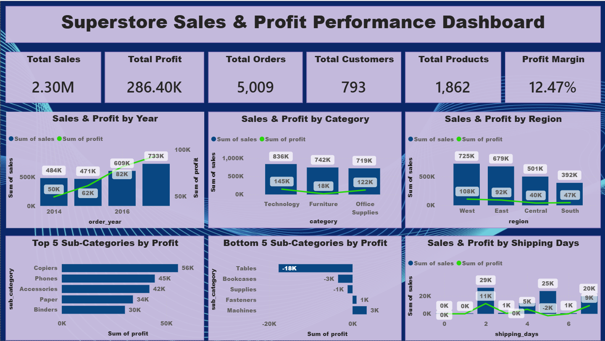
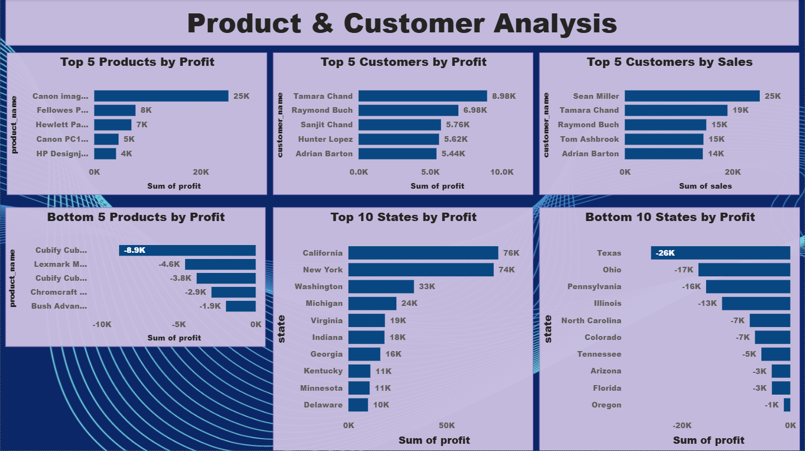

# 📊 Superstore Sales & Profit Analysis

## 📌 Project Overview

This project analyzes Superstore sales and profit data using Python, Pandas, and Power BI.

The goal is to identify sales and profit trends, category and regional performance, product and customer performance, state-level profitability, and shipping-day patterns.

## 🎯 Objective

To analyze Superstore sales data and identify profitable areas, loss-making areas, important trends, and business opportunities that can support better decision-making.

## 🛠️ Tools & Technologies

- 🐍 Python
- 🐼 Pandas
- ☁️ Google Colab
- 📊 Power BI Desktop
- 📄 CSV

## 🔄 Project Workflow

Raw Superstore Data  
↓  
Python / Pandas  
↓  
Data Cleaning & Preparation  
↓  
Analytical Datasets  
↓  
Power BI  
↓  
Two-Page Dashboard  
↓  
Business Insights & Recommendations

## 📈 Dashboard

### 🖼️ Dashboard Preview

#### 📊 Page 1 — Executive Summary



#### 🔎 Page 2 — Product & Customer Analysis



### 📄 View the Power BI Report

[📥 Download Power BI PDF](02_PowerBI/Superstore_Sales_Profit_Analysis.pdf)

### 📊 Page 1 — Executive Summary

The first dashboard page provides an overview of:

- Total Sales
- Total Profit
- Total Orders
- Total Customers
- Total Products
- Overall Profit Margin
- Sales & Profit by Year
- Sales & Profit by Category
- Sales & Profit by Region
- Top 5 Sub-Categories by Profit
- Bottom 5 Sub-Categories by Profit
- Sales & Profit by Shipping Days

### 🔎 Page 2 — Product & Customer Analysis

The second page focuses on:

- Top 5 Customers by Profit
- Top 5 Customers by Sales
- Top 5 Products by Profit
- Bottom 5 Products by Profit
- Top 10 States by Profit
- Bottom 10 States by Profit

## 💡 Key Findings

- Sales and profit increased overall from 2014 to 2017.
- 2017 recorded the strongest overall sales and profit performance.
- Technology was the leading category in terms of sales.
- West was the highest-sales region.
- Copiers was the most profitable sub-category.
- Tables was the lowest-performing sub-category by profit and generated a significant loss.
- Product-level analysis identified both highly profitable and loss-making products.
- The Canon imageCLASS 2200 Advanced Copier was the highest-profit product in the analysis.
- The shipping-day analysis showed that 2 shipping days recorded the highest sales and profit performance in the dashboard.

## 🚀 Business Recommendations

- Investigate the reasons for losses in the Tables sub-category.
- Review pricing, discount levels, product costs, and shipping costs for loss-making products.
- Focus on consistently profitable products and identify opportunities to increase their sales.
- Review whether high discounts are reducing profit margins.
- Study the factors behind Technology's strong sales performance.
- Analyze the reasons for the West region's strong performance.
- Investigate the relationship between shipping duration, sales, and profitability.

## 📂 Project Files

### 🐍 Python Analysis

[📓 View Python Analysis Notebook](04_Python/Superstore_Analysis.ipynb)

### 📊 Power BI

[📄 View Power BI PDF Report](02_PowerBI/Superstore_Sales_Profit_Analysis.pdf)

### 📁 Data

- [📄 Cleaned Superstore Dataset](01_Data/superstore_cleaned.csv)
- [📄 Sub-Category Analysis Dataset](01_Data/dashboard_subcategory.csv)
- [📄 Product Analysis Dataset](01_Data/dashboard_product.csv)
- [📄 Customer Analysis Dataset](01_Data/dashboard_customer.csv)

### 🖼️ Dashboard Screenshots

- [📊 Dashboard Page 1](03_Dashboard/dashboard-page-1.png)
- [🔎 Dashboard Page 2](03_Dashboard/dashboard-page-2.png)

## 📁 Project Structure

```text
Superstore Sales & Profit Analysis
│
├── README.md
│
├── 01_Data
│   ├── superstore_cleaned.csv
│   ├── dashboard_subcategory.csv
│   ├── dashboard_product.csv
│   └── dashboard_customer.csv
│
├── 02_PowerBI
│   └── Superstore_Sales_Profit_Analysis.pdf
│
├── 03_Dashboard
│   ├── dashboard-page-1.png
│   └── dashboard-page-2.png
│
└── 04_Python
    └── Superstore_Analysis.ipynb
```

## 👩‍💻 My Role

I worked on the complete data analytics workflow for the Superstore dataset.

I used Python and Pandas to inspect, clean, transform, and analyze the data. I created supporting analytical datasets for sub-category, product, and customer analysis.

I then used Power BI to build a two-page sales and profit dashboard and identified key business insights and recommendations from the analysis.

## 📝 Conclusion

This project demonstrates an end-to-end data analytics workflow using Python and Power BI, from data preparation and analysis through dashboard development and business recommendations.

The project highlights the ability to transform raw business data into meaningful insights and communicate those insights through an interactive Power BI dashboard.
